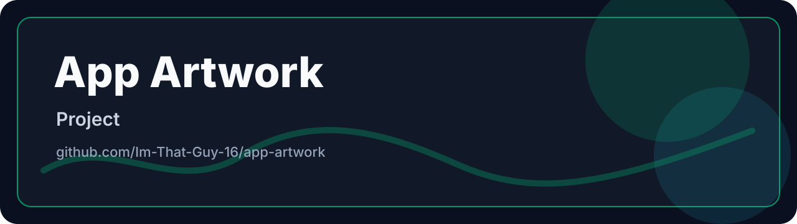

  

  
  

# App Artwork

Public artwork and README media for the private macOS app repositories.

## Overview

Public artwork and README media for the private macOS app repositories.

## Tech Stack

- `HTML`

## Repository Map

- `brand/` - source, assets, or supporting files.
- `assets/` - source, assets, or supporting files.

## Run / Open

Open the repository with the relevant local toolchain for this project.

## Maintenance

- Keep generated files, runtime data, secrets, dependency folders, and build caches out of Git.
- Keep the GitHub description and repository topics aligned with the README.

## License

See [LICENSE](LICENSE) if present in this repository.
